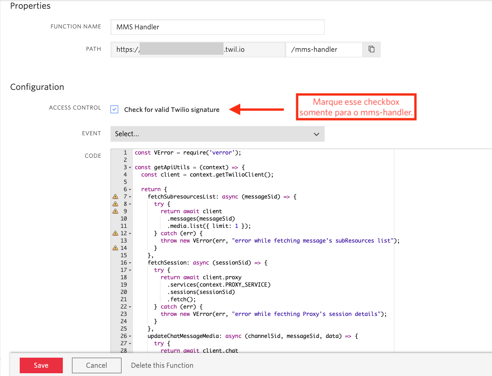
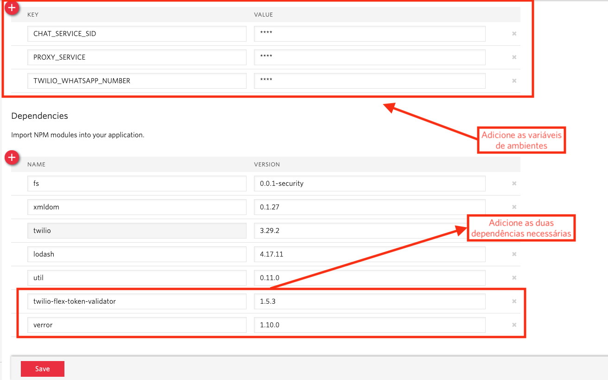
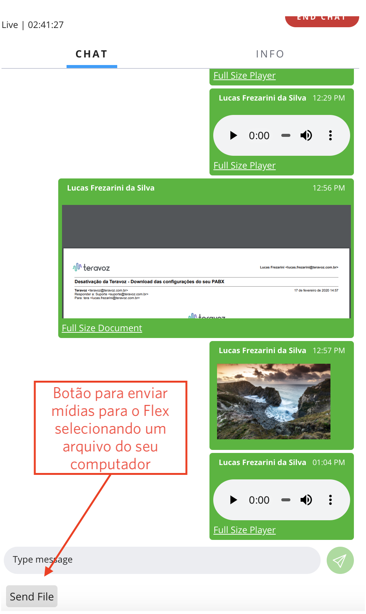

# mms2FlexChat

Permite que usuários enviem e recebia mídias MMS por SMS/Whatsapp e renderiza dentro da janela de chat do Flex.

# Configuração

## Twilio Functions

Para permitir o envio de mídia MMS para o chat do flex, duas Twilio Functions são necessárias. Elas podem ser encontradas dentro da pasta `twilio-functions/functions` desse repositório. Abaixo, você pode ver uma breve descrição sobre o que cada uma delas faz:

1) mms-handler.protected.js: Essa Function vai ser chamada toda vez que ocorrer uma interação com o Twilio Proxy, usando o URI do Proxy Callback. Ela vai checar se um MMS existe na mensagem de SMS/Whatsapp recebida.

2) send-media-message.js: Essa Function vai ser chamada pelo plugin do Flex para enviar a mídia para o cliente usando a API de mensagens da Twilio. O Proxy não suporta mensagens com mídia, então temos que chamar a API de mensagens diretamente por essa função para fazer um caminho alternativo.

Você pode realizar o upload dessas funções em sua conta da Twilio por dos métodos: realizando o upload via o [Serverless Toolkit](https://www.twilio.com/docs/labs/serverless-toolkit) ou copiando e colando o código das funções na [interface de Functions](https://www.twilio.com/console/functions/manage) no Console da Twilio.

Em qualquer uma das opções que você escolher, as seguintes variáveis de ambiente devem ser definidas:

* **PROXY_SERVICE**
    * SID do Proxy Service em que as mensagens de MMS e de WhatsApp são direcionadas
    * Você pode encontrar essa informação no [Dashboard do Proxy](https://www.twilio.com/console/proxy). Por padrão, o Proxy usado pelo Flex tem o nome de "Flex Proxy Service".
* **CHAT_SERVICE_SID**
    * SID do serviço de Programmable Chat usado em seus Flows do Flex
    * Você pode encontrar essa informação no [Dashboard do Programmable Chat](https://www.twilio.com/console/chat/dashboard). Por padrão, o Service usado pelo Flex tem o nome de "Flex Chat Service".
* **TWILIO_WHATSAPP_NUMBER**
    * O número do WhatsApp que será usado para enviar mensagens à um destinatário do WhatsApp.
    * Você pode encontrar essa informação na página do [WhatsApp Learn](https://www.twilio.com/console/sms/whatsapp/learn) se você estiver usando um número de testes ou na página do [WhatsApp Senders](https://www.twilio.com/console/sms/whatsapp/senders) se você já habilitou o uso de números personalizados. O número deve seguir o formato `+1122333334444` (com o código do país e o DDD seguido pelo número)
* **TWILIO_SMS_NUMBER**
    * O número que será usado para enviar mensagens à um destinatário por MMS.
    * Você pode usar o mesmo número do WhatsApp caso você já tenha habilitado um número personalizado com capacidade de enviar SMS. Caso o contrário, você pode usar algum outro número da Twilio para realizar o envio de mídias por SMS. Você pode gerenciar seus números no [Dashboard de números ativos da Twilio](https://www.twilio.com/console/phone-numbers/incoming). O número deve seguir o formato `+1122333334444` (com o código do país e o DDD seguido pelo número)

## Opção 1: Copiando o código para a interface do Twilio Functions

Copiar o código das funções diretamente para a interface do console da Twilio é a forma mais rápida de começar. Porém, caso você queira debugar o código com mais detalhes e testar alterações em sua máquina local, dê uma olhada em [como usar o serverless toolkit](#Fazendo-o-deploy-das-functions-usando-o-serverless-toolkit).

[No dashboard do Twilio Functions](https://www.twilio.com/console/functions/manage), crie duas novas funções: uma chamada `MMS Handler` e outra com o nome de `Send Media Message`. Defina o path delas como `/mms-handler` e `/send-media-message`, respectivamente. Copie o código e cada função dentro do diretório `twilio-functions/functions` e cole em suas respectivas Functions na interface.



Somente a função `mms-handler` deve checar a assinatura da Twilio. Isso porque ela vai ser chamada diretamente de dentro da Twilio pelo serviço do Proxy. Como a função `send-media-message` precisa ser chamada no lado do cliente pelo Flex, não podemos deixar essa opção habilitada no caso dela.

Salve as alterações nas duas funções. Recomendo que você já salve o Path delas em algum arquivo de texto, já que você vai precisar dessa informação mais tarde.

Agora, na [página de configuração das funções](https://www.twilio.com/console/functions/configure), certifique-se de que o checkbox "Enable ACCOUNT_SID and AUTH_TOKEN" está marcado. Na seção "Environment Variables", adicione as variáveis de ambientes descritas anteriormente.

Você também vai precisar adicionar as seguintes dependências para as funções funcionarem corretamente: 

* twilio-flex-token-validator (1.5.3) -> Valida o token do Flex que será enviado no client-side do Flex UI
* verror (1.10.0) -> usado na função de MMS handler para adicionar mais detalhes aos erros caso alguma coisa dê errado.



> Copie e cole o nome da dependência `twilio-flex-token-validator` quando você for defini-la. Existe um bug na interface que, se você digitar 'twilio' no nome da dependência, o campo vai travar e você não vai conseguir digitar mais nada nele.

Salve as modificações. Depois disso, você está pronto para configurar o Proxy e o Plugin do Flex.

## Opção 2: Fazendo o Deploy das Functions usando o Serverless Toolkit

### Configurando o Twilio CLI

Primeiramente, realize o clone desse repositório em sua máquina. Em seguida, certifique-se de que o [twilio-cli](https://www.twilio.com/docs/twilio-cli/quickstart) está instalado em sua máquina. Você pode fazer isso simplesmente digitando `twilio` em seu terminal:

```zsh
$ twilio

# output: 

unleash the power of Twilio from your command prompt

VERSION
  twilio-cli/2.3.0 darwin-x64 node-v12.14.1

USAGE
  $ twilio [COMMAND]
  [...]
```
Caso ele ainda não esteja instalado em sua máquina, siga o [quickstart](https://www.twilio.com/docs/twilio-cli/quickstart) para instalá-lo.

Se o CLI já estava instalado em sua máquina, rode o comando `twilio profiles:list` e confira se a conta ativa no momento é a sua conta do Flex que você deseja usar para enviar/receber mídia:

```zsh
$ twilio profiles:list

ID               Account SID                         Active
flex-whatsapp    AC00000000000000000000000000000000  true  
other-account    AC00000000000000000000000000000000        
not-this-one     AC00000000000000000000000000000000         
```

Se sua conta do Flex já estiver na listagem mas não for a conta ativa no momento, você pode alternar para ela usando o comando `twilio profiles:use <ID-da-sua-conta-do-flex>`:

```zsh
$ twilio profiles:use flex-whatsapp
set "flex-whatsapp" as active profile
```

Caso seja a primeira vez que você esteja usando o `twilio-cli` ou se sua conta do Flex não apareceu na listagem de profiles, então você deve executar o comando `twilio login` e informar seu **ACCOUNT_SID** e seu **AUTH_TOKEN** para se autenticar em sua conta do flex.

### Instalando o plugin do serverless e realizando o Deploy das functions

Se o `twilio-cli` já estava instalado em sua máquina, confira se o plugin do serverless também já está instalado:

```zsh
$ twilio plugins
@twilio-labs/plugin-rtc 0.1.6
@twilio-labs/plugin-serverless 1.1.1 # Serverless Plugin
```

Caso ele não tenha aparecido na listagem ou você tenha acabado de instalar o `twilio-cli`, rode o seguinte comando para instalar o plugin do serverless:

```zsh
$ twilio plugins:install @twilio-labs/plugin-serverless
```

Dentro da pasta `twilio-functions`, copie o arquivo `.env.example` e crie um arquivo `.env` propriamente dito. Preencha ele com as informações definidas no arquivo de exemplo. Cheque a descrição das variáveis de ambientes mais acima caso você precise de mais detalhes sobre elas.

```
ACCOUNT_SID=AC0000000000000000000000000000000000
AUTH_TOKEN=0000000000000000000000000000000000000
CHAT_SERVICE_SID=IS00000000000000000000000000000
PROXY_SERVICE=KS00000000000000000000000000000000
TWILIO_WHATSAPP_NUMBER=+14155238886
TWILIO_SMS_NUMBER=+19999999999
```

Depois de preencher todos esses dados, basta realizar o deploy das funções em sua conta:

```zsh
$ twilio serverless:deploy

# Output: 

Deployment Details
Domain: your-domain-dev.twil.io
Service:
   mms-media (ZS0000000000000000000000000000)
Environment:
   dev (ZE0000000000000000000000000000) 
Build SID:
   ZB0000000000000000000000000000
View Live Logs:
   https://www.twilio.com/console/assets/api/ZS0000000000000000000000000000/environment/ZE0000000000000000000000000000
Functions:
   [protected] https://your-domain-dev.twil.io/mms-handler
   https://your-domain-dev.twil.io/send-media-message
Assets:
```

Depois que o deploy for realizado com sucesso, copie e salve o link do seu domínio e a URL de suas Functions no resultado do comando acima.

## Configurando o Twilio Proxy

Como o Twilio Proxy não suporta mensagens com mídia nativamente, é necessário monitorar essas mensagens para detectar essas mensagens com mídia e só então atualizar os atributos da mensagem com o URL da mídia e seu tipo. Isso é responsabilidade da função `mms-handler`, que o deploy foi realizado anteriormente.

Agora, você precisa configurar o URL do Proxy Callback para o endpoint dessa função.

1) Navegue para o [Dashboard do Proxy](https://www.twilio.com/console/proxy) e clique no Proxy Service usado pelo seu número do WhatsApp e do MMS.

2) No campo `Callback URL`, coloque a URL da função `mms-handler`. Caso você tenha feito o deploy via `twilio-cli`, você terá acesso a essa URL depois que o deploy for feito com sucesso. Se você tiver copiado e colado o código da função usando a página de Functions no Twilio Console, você pode obter a URL acessando [o dashboard das Functions](https://www.twilio.com/console/functions/manage), selecionando a função do `mms-handler` e clicando no botão de cópia perto do campo `Path`.


3) Clique no botão `Save` no final da página de configuração depois que você preencheu o `Callback URL`.

## Subindo o Plugin do Flex

Na pasta `flex-plugin` na raiz desse repositório está um plugin do Flex que deve ser implementado para possibilitar que a mídia recebida seja exibida exibida corretamente. Abaixo, você pode ver algumas imagens demonstrando o funcionamento dele:




Realizar o deploy desse plugin é bem simples: entre no diretório `flex-plugin` e instale as dependências:

```zsh
$ npm i
```

Depois disso, crie um arquivo `.env.production` com base no `.env.example`, e preencha o único parâmetro com o domínio das funções:

```javascript
REACT_APP_MMS_FUNCTIONS_DOMAIN=https://your_functions_domain
```

Após você ter feito isso, copie o arquivo `appConfig.example.js` dentro da pasta `flex-plugin/public` e crie um arquivo chamado `appConfig.js`. Defina o valor da variável `accountSid` como o **ACCOUNT_SID**:

```javascript
// your account sid
var accountSid = 'AC000000000000000000000000000000000';

// set to /plugins.json for local dev
// set to /plugins.local.build.json for testing your build
// set to "" for the default live plugin loader
var pluginServiceUrl = '/plugins.json';

var appConfig = {
  pluginService: {
    enabled: true,
    url: pluginServiceUrl,
  },
  sso: {
    accountSid: accountSid
  },
  ytica: false,
  logLevel: 'debug',
  showSupervisorDesktopView: true,
};
```

Por último, rode o comando `npm run deploy`. Recomendo que ao rodar o comando pela primeira vez você defina o accountSid e o authToken da sua conta do flex da seguinte maneira: 

```
TWILIO_ACCOUNT_SID=AC0000000 TWILIO_AUTH_TOKEN=00000000000 npm run deploy
```

Dessa forma, caso você já tenha realizado um deploy em alguma outra conta, você tem certeza de que o deploy desse plugin em específico vai subir na conta com o SID especificado. Você não precisa especificar esses parâmetros nos próximos deploys, já que essa conta será usada por padrão ou se você tiver mais de uma conta registrada você terá que selecionar em qual delas você quer realizar o deploy antes de fazer o processo.

Agora é só você abrir o seu painel de [administrador do Flex](https://flex.twilio.com/admin) e testar se está tudo funcionando!

## Debuggando o código no ambiente local

### Rodando as Twilio Functions localmente usando o serverless toolkit

Caso você tenha optado pela segunda opção para realizar o deploy das funções, você pode rodá-las em um ambiente local para testar as modificações ou debugar o que está acontecendo por trás dos panos.

Dentro do diretório `twilio-functions`, instale as dependências do projeto:

```zsh
$ npm i
```

Depois disso, use o Serverless Toolkit para inicializar suas funções:

```zsh
$ twilio serverless:start

┌────────────────────────────────────────────────────────────────────────┐
│                                                                        │
│   Twilio functions available:                                          │
│   ├── [protected] /mms-handler | http://localhost:3000/mms-handler     │
│   └── /send-media-message | http://localhost:3000/send-media-message   │
│                                                                        │
│   Twilio assets available:                                             │
│   ⚠ No assets found                                                    │
│                                                                        │
└────────────────────────────────────────────────────────────────────────┘

```

Para usar o `mms-handler` local no Callback URL do Proxy, você terá que usar o [ngrok](https://ngrok.com/) ou alguma ferramenta do tipo. O ngrok vai gerar uma URL que aponta para a sua máquina na porta definida ao inicializá-lo. Instale o ngrok em algum diretório da sua máquina e o execute passando os seguintes argumentos:

```zsh
$ ./ngrok http 3000

ngrok by @inconshreveable                                           (Ctrl+C to quit)
                                                                                    
Session Status                online                                                
Account                       Your account                                 
Version                       2.3.35                                                
Region                        United States (us)                                    
Web Interface                 http://127.0.0.1:3041                                 
Forwarding                    http://your_url.ngrok.io -> http://localhost:3000 
Forwarding                    https://your_url.ngrok.io -> http://localhost:3000
```

Assim, uma URL será gerada para rotear conexões http para o seu localhost na porta 3000. Copie a última URL HTTPS e defina o endpoint do `mms-handler` no formato `https://your_url.ngrok.io/mms-handler` como o callback URL no [Proxy do Flex](https://www.twilio.com/console/proxy), assim como foi feito no passo de [configurar o Twilio Proxy](#Configurando-o-twilio-proxy).


No plugin do Flex, você pode definir para chamar a função `send-media-message` no localhost modificando o arquivo `flex-plugin/.env`. As instruções para rodar o plugin em sua máquina estão descritas abaixo.

### Rodando o Plugin do Flex em sua própria máquina

Para testar rapidamente esse plugin rodando uma instância do Flex local, primeiro você deve realizar login no [Console da Twilio](https://www.twilio.com/login). Depois, dentro da pasta `flex-plugin`, instale as dependências do projeto:

```zsh
$ npm i
```

Crie um arquivo `.env`, diferente do de produção, com base no `.env.example`, e preencha o único parâmetro com o domínio das funções. Caso você também esteja rodando as funções em seu ambiente local, especificar o domínio como localhost ou a URL do ngrok:

```javascript
REACT_APP_MMS_FUNCTIONS_DOMAIN=https://your_functions_domain
```

> É recomendado que você tenha o arquivo `.env` para realizar testes locais e o `.env.production` para ser usado na hora do deploy. Quando você rodar o comando `npm run deploy`, o arquivo env de produção vai ser usado no lugar do `.env` padrão.

Após você ter feito isso, copie o arquivo `appConfig.example.js` dentro da pasta `flex-plugin/public` e crie um arquivo chamado `appConfig.js`. Defina o valor da variável `accountSid` como o **ACCOUNT_SID**:

```javascript
// your account sid
var accountSid = 'AC000000000000000000000000000000000';

// set to /plugins.json for local dev
// set to /plugins.local.build.json for testing your build
// set to "" for the default live plugin loader
var pluginServiceUrl = '/plugins.json';

var appConfig = {
  pluginService: {
    enabled: true,
    url: pluginServiceUrl,
  },
  sso: {
    accountSid: accountSid
  },
  ytica: false,
  logLevel: 'debug',
  showSupervisorDesktopView: true,
};
```

Finalmente, rode o comando `PORT=8080 npm start`. Isso deve iniciar um servidor na porta 8080 com sua instância local do plugin e abrir o seu browser padrão conectado ao flex. 

> A porta 8080 foi especificada para evitar conflito com as Functions se as mesmas estiverem rodando em um servidor local.

```
$ npm start

Compiled successfully!

You can now view plugin-sms-media in the browser.

  Local:            http://localhost:8080/
  On Your Network:  http://192.168.0.2:8080/

Note that the development build is not optimized.
To create a production build, use npm run build.
```

Pronto! Agora, você pode testar suas modificações localmente.
